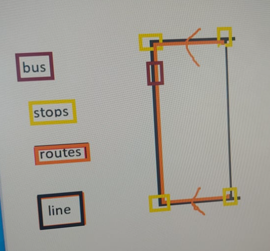
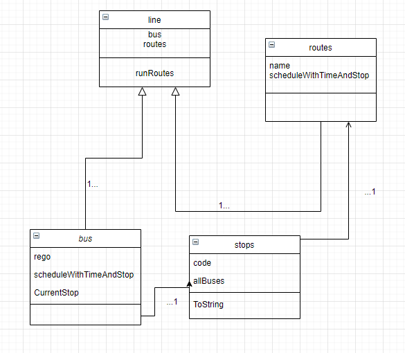

# Read me

## Description

You have been put in charge of designing and building the new SpeedCo Bus
system. This is a critical piece of infrastructure for SpeedCo, it must handle
registering their fleet of buses, setting up lines as a series of routes
(usually two, a forward and a return), setting up routes as a series of stops,
and scheduling those buses to run lines at certain times.

## Requirements

Your system must allow:
  - Adding and removing buses with their registration (eg: ABC-123)
  - Adding and removing stops with their code (eg: A1, B3, Q42)
  - Adding and removing routes with their name (eg: M44, H22, G40)
  - Adding and removing lines
  - Scheduling lines to a bus for a given time

Your submitted program must setup at least one bus with a line assigned to it.

## What's require to fun the program 
- visual studio for .net window

## Design
Basic concept 

## Domain diagram
Line do all the work on all the routes running
Routes store name and scheduleWithTimeAndStop
Bus store rego currentstop and the same reference of scheduleWithTimeAndStop
Stops store code and allbuses in the stop and the toString function

## furture impermentation
Can put in concurrent feature to make the program able to run multiple routes at the same time